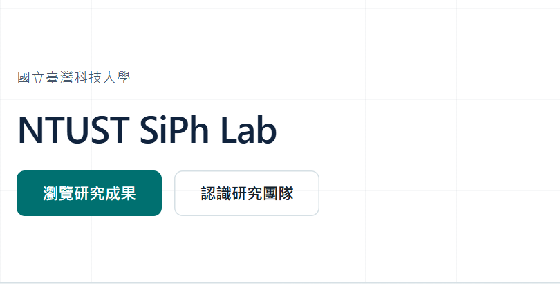

# NTUST SiPh Lab

A research-lab website with a small admin workspace for people, publications, and equipment pages.
Visitors browse the lab; one administrator edits content and publishes it after review.

[Live site](https://ntust-siph-lab-105924420674.asia-east1.run.app) · [Local setup](#try-it-locally) · [Content guide](docs/content-guide.md)

The live homepage and `/health` responded successfully on 2026-10-01. Search indexing remains blocked. The repository's final content sign-off is still incomplete; an available site does not mean the content review is complete.



*Real local UI from the repository's legacy import. The screenshot focuses on
the lab introduction and browsing links. Original Traditional Chinese labels;
no unpublished equipment draft or invented research result is shown.*

## Try it locally

Use Docker Compose on a machine where port 8000 and the container name `siph-lab-web` are free. Local development uses SQLite and needs no cloud account.

```bash
git clone https://github.com/SpadesZ/ntust-siph-lab.git
cd ntust-siph-lab
docker compose up --build -d
docker compose exec web flask db upgrade
docker compose exec web flask admin create --username admin --generate
docker compose exec web flask seed legacy
curl -i http://127.0.0.1:8000/health
```

The generated admin password is shown once. Open `http://127.0.0.1:8000` and `/admin/login`. Legacy import is optional and retains known content gaps; use the [content guide](docs/content-guide.md) and [sign-off record](legacy/google_sites/content_signoff.md) before publishing changes.

Use `/health` for the public health route; `/healthz` also exists for container
checks. Local checks do not complete the content sign-off or verify a deployment.

## Technical details — 繁體中文

The existing technical notes and operating rules follow in Traditional Chinese.

### 本機驗證範圍

2026-10-01 已驗證 fresh SQLite migration、admin creation 與 legacy import。
2026-10-02 在同一隔離 demo，以最新 checkout 重驗首頁、`/health`、`/healthz`、robots 與真瀏覽器。
既有 image 提供依賴；未重建完整 image、未執行 production migration 或修改內容簽核與 cloud 設定。

### 原有技術與維護文件

國立臺灣科技大學 SiPh Lab（矽光子實驗室）的官方研究網站，
由單一管理員透過 `/admin` 維護全部公開內容。

- **前台**：首頁、關於、研究成員、研究成果、研究設備、畢業生、加入我們
- **後台**：單一管理帳號的輕量 CMS，不需要碰程式即可維護內容
- **架構**：Flask + Jinja2 SSR + SQLAlchemy；本機 SQLite，正式環境 Cloud Run + Neon PostgreSQL + Cloud Storage（ADR-013 取代原 Cloud SQL 選擇）

規格書：`docs/SAI.md`（NTUST SiPh Lab SAI v1.2）

---

### 快速開始

### 方式 A：Docker（建議，與正式環境同一份 image）

```bash
docker compose up --build -d

# 首次啟動必須手動初始化（刻意不自動執行，見 docker-compose.yml）
docker compose exec web flask db upgrade
docker compose exec web flask admin create --username admin --generate
docker compose exec web flask seed legacy        # 匯入母站內容（選用）

curl -i http://127.0.0.1:8000/healthz
```

開啟 http://127.0.0.1:8000 ，後台在 http://127.0.0.1:8000/admin/login

> `.env.local` 是**選用**的。不建立也能啟動（compose 內含本機預設值）；
> 需要覆寫設定時再 `cp .env.example .env.local`。

### 方式 B：本機 Python

```bash
python -m venv .venv
source .venv/bin/activate          # Windows: .venv\Scripts\activate
pip install -r requirements.txt -r requirements-dev.txt

cp .env.example .env.local

export FLASK_APP=wsgi.py           # Windows: $env:FLASK_APP="wsgi.py"
flask db upgrade
flask admin create --username admin --generate
flask seed legacy

# 開發伺服器（僅限開發；正式環境一律 Gunicorn，見 AC-20）
flask run --port 8000
```

詳細說明：`docs/local-development.md`

---

### 常用指令

| 指令 | 用途 |
| --- | --- |
| `flask db upgrade` | 建立／更新資料庫 schema |
| `flask admin create --username X --generate` | 建立管理員（密碼只顯示一次） |
| `flask admin reset-password --username X --generate` | 重設密碼（忘記密碼時） |
| `flask admin list` | 列出管理員帳號 |
| `flask seed legacy` | 匯入母站 Legacy Baseline（LC-001~LC-019） |
| `flask check publish` | 批次檢查發布門檻，有阻擋問題時回非零 exit code |
| `pytest` | 全部測試 |
| `pytest -m acceptance` | 只跑對應 AC-01~AC-26 的驗收測試 |
| `python scripts/backup_sqlite.py` | 建立備份 |
| `python scripts/backup_sqlite.py --verify-latest` | 還原演練（AC-14） |
| `python scripts/verify_migration.py` | 產生 legacy difference report |

---

### 專案結構

```
app/
├── __init__.py          create_app() 應用組裝點
├── config.py            環境差異的唯一收斂點
├── extensions.py        db / migrate / login / csrf / limiter
├── cli.py               flask admin / check / seed 指令
├── models/              7 張原始核心表 + Equipment（第 8 張表）
├── repositories/        DB-portable 查詢邊界
├── services/            商業邏輯（發布、graduate、SEO、schema、媒體）
├── storage/             StorageBackend：local | gcs
├── blueprints/          public / auth / admin
├── templates/           Jinja2（public / admin / errors）
└── static/              tokens.css / main.css / admin.css

legacy/google_sites/     母站零遺漏遷移的證據鏈（inventory / mapping /
                         manifest / difference report / sign-off）
migrations/              Alembic（SQLite 與 PostgreSQL 皆可）
scripts/                 維運與遷移工具
deploy/                  Cloud Run 部署與 cutover runbook
skills/                  專案 Skill（設計 / SEO-GEO 契約）
docs/                    規格與操作文件
tests/                   單元／路由／安全／SEO／a11y／可攜性測試
```

---

### 核心設計決策

| 決策 | 理由 |
| --- | --- |
| Flask + Jinja SSR（ADR-001） | 首個 response 即含完整 HTML 與 metadata，維持 SEO/GEO 與維護單純性 |
| Local-first SQLite（ADR-002） | 開發與內容驗收不需要任何 GCP 資源，降低成本與環境摩擦 |
| SQLAlchemy + Alembic（ADR-003） | Model 與 migration 不依賴 SQLite-only 技巧，保留 PostgreSQL 遷移路徑 |
| 單一 Admin 帳號（ADR-007） | 符合實際維護需求，避免過早導入 RBAC |
| Person 單一人物實體（ADR-008） | 學生畢業只改狀態，不搬資料；成果關聯不斷裂 |
| Legacy Preservation Gate（ADR-011） | 母站內容零遺漏；未經核准不得刪除或以推測內容取代 |

**沒有前端框架、沒有 REST API。** 公開頁由 Flask 直接輸出 HTML，
CMS 也是 server-rendered form。除 `/healthz` 外不建立 API，
以降低權限、CORS、版本治理與攻擊面（SAI §9.5）。

---

### 開發規則（SAI §23.1）

修改功能前請先讀：

1. `docs/SAI.md`
2. `skills/siph-lab-web-design/SKILL.md`（任何 template / CSS / UX 變更）
3. `skills/siph-lab-seo-geo/SKILL.md`（任何影響 metadata / 結構化資料的變更）

硬性規定：

- 本機預設 SQLite，**不得**為了「像 production」而要求先建立 Cloud SQL
- **不得**在 business / service / route 層寫 SQLite-only SQL
- 所有 schema 變更建立 Alembic migration，並測 SQLite 與 PostgreSQL
- 所有媒體存取透過 `StorageBackend`；template 不可假設 `/uploads` 是本機檔案
- 新增 public page 必須同時處理 title、description、canonical、sitemap、結構化資料
- 所有 Admin mutation 必須 auth + CSRF + server 端驗證
- **沒有真實資料時不可虛構內容**（見下）

### 關於「不得虛構」

母站不存在的資料（研究成果、畢業生、成員英文名、論文題目、去向等）
**不得由開發者或 AI 從網路推測後填入**。正確做法是留空、在
`legacy/google_sites/migration_inventory.csv` 標記待補，並由研究室提供。

這不是風格偏好，是 ADR-011 與 SAI §2.3 的硬性要求，也是這個
研究網站可信度的基礎。

---

### 正式部署

目前資料庫選擇為 Neon PostgreSQL，見 [ADR-013](docs/adr/ADR-013-managed-postgres-provider.md)。早期規格與 runbook 的 Cloud SQL 內容保留為歷史背景，應以此 ADR 為準。

2026-10-01 只讀檢查：公開首頁與 `/health` 回應 200；robots 仍禁止索引。`legacy/google_sites/content_signoff.md` 的人工簽核尚未完成。此檢查不驗證部署 revision、費用或資料完整性。

開發階段**不需要**任何 GCP 資源。準備上線時再讀：

- `deploy/cloudrun.md` — GCP 資源建立與部署步驟
- `deploy/migration-runbook.md` — cutover 逐步程序與 rollback
- `docs/cloudrun-deployment.md` — 環境變數逐項說明

正式環境強制條件（`ProductionConfig` 會在啟動時檢查並拒絕）：
PostgreSQL（非 SQLite）、`STORAGE_BACKEND=gcs`、有 `SECRET_KEY`、
`PUBLIC_BASE_URL` 非 localhost。

---

### 授權與資料

- 人物照片與個人資料屬個資，**不進入版本控制**（見 `.gitignore`）
- `legacy/google_sites/` 刻意納入版控：那是零遺漏遷移的稽核證據
- 校徽等校方識別資產的使用須符合校方規範
